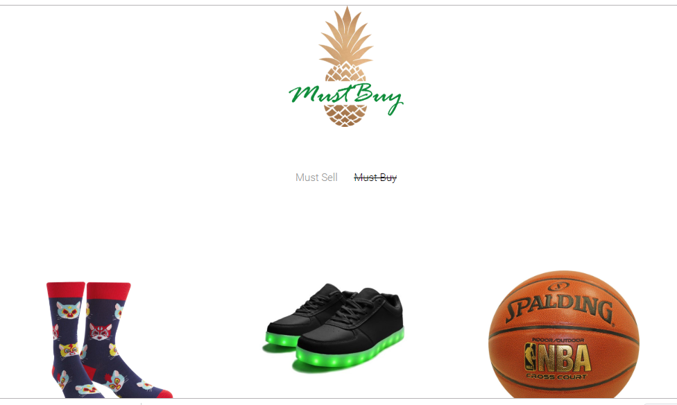

_MustBuy_

---

A full stack web application that serves as a storefront to sell your unwanted stuff and also offers the unique opportunity to buy someone else’s stuff at your leisure. People have asked us "Why the Pineapple?" The pineapple symbolizes friendship, hospitality, warmth and good luck! And as our client using MustBuy, our team would personally like to wish YOU all the pineapples this world has to offer!

Direct link to MustBuy [here](https://mustbuy.herokuapp.com/)

---

- **For:** Southern Methodist University Coding Bootcamp
- **Developers:** John Hambry, Victor Lineros, Sunny Patel, and Alicia Garcia
- **Deployment Date:** 06/26/2019
- **Technologies Used:** Node.js (JavaScript environment), JavaScript, freehtml5 (base framework), Bootstrap, CSS, Express.js (server framework), handlebars (templating engine), Heroku (cloud platform), JawsDB (Heroku database add-on), MySQL2 (a Relational Database Management System), Sequelize (Object Relational Mapping).

---

### Description & Requirements

Get link to Project 2 requirements [here](https://drive.google.com/file/d/15i7nSFby2ObN3Awxiv1KX7UWiWNq__n6/view?usp=sharing)

The following npm packages were installed:

1. **Dotenv:** Dotenv is a simple way to allow you to create secret keys that your application needs to function and keep them from going public.

   _Command Line: 'npm install dotenv'_

2) **MySQL2:** `Node-MySQL2` offers better performance over `node-mysql`, and also supports additional features MySQL doesn't.

   _Command Line: 'npm i mysql2'_

3.  **Sequelize:** Sequelize is a promise-based Node.js ORM for Postgres, MySQL, MariaDB, SQLite and Microsoft SQL Server. It features solid transaction support, relations, eager and lazy loading, read replication and more.

    _Command Line: 'npm i sequelize'_

4.  **Express:** Express is a fast, unopinionated, minimalist web framework for node.

    _Command Line: 'npm i express'_

5.  **Express-Handlebars:** A Handlebars view engine for Express which doesn't suck. Handlebars.js is an extension to the Mustache templating language created by Chris Wanstrath. Handlebars.js and Mustache are both logicless templating languages that keep the view and the code separated like we all know they should be.

    _Command Line: 'npm i express-handlebars'_

---

### Functionality

It’s simple: At the top click on 'MustSell' to sell your stuff or scroll through all the available items and click on the item to buy!

Here is screen-shot of MustBuy's home page:

## 

- **Demo**
  See a full demo on the functionality of the app [here!]()
